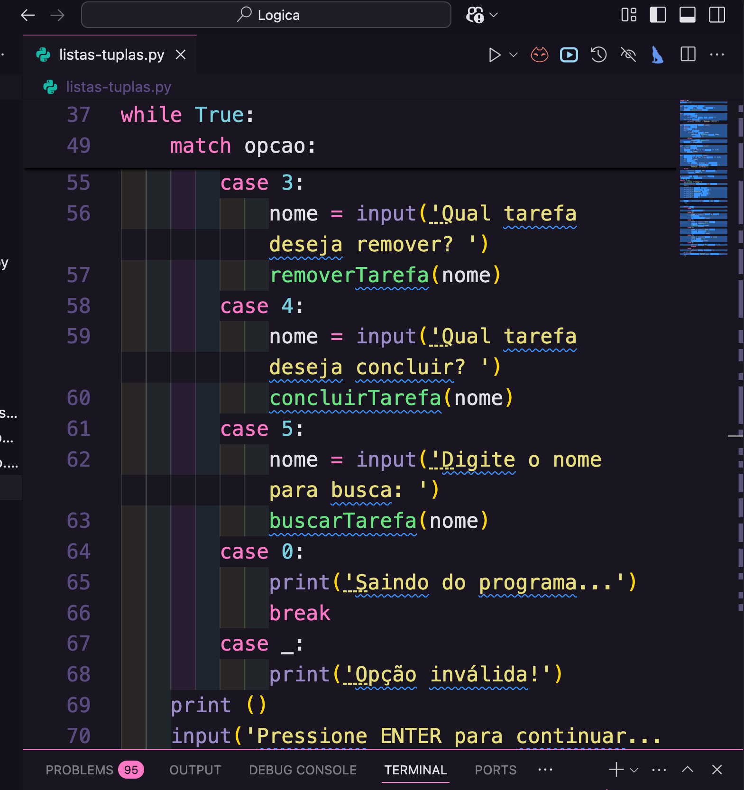

# 📝 Gerenciador de Tarefas em Python

---

## 📸 Preview do Projeto

Aqui está uma demonstração do sistema em funcionamento:

  

---

## 🚀 Funcionalidades

O sistema oferece uma interface de menu interativa para:

* ✅ **Adicionar Tarefas:** Criação de novos itens com status "pendente".
* 📜 **Listar Tarefas:** Visualização organizada de todas as atividades.
* 🔍 **Buscar por Nome:** Localização rápida de tarefas específicas.
* ✔️ **Concluir Tarefas:** Atualização do status para "concluída".
* 🗑️ **Remover Tarefas:** Exclusão de itens da lista.
* 🚪 **Sair:** Encerramento seguro da aplicação.

---

## 🛠️ Tecnologias e Conceitos Aplicados

Para construir este gerenciador, utilizei:
* **Estruturas de Controle:** `while True` e o moderno `match/case` do Python 3.10+.
* **Manipulação de Dados:** Listas, Tuplas e *List Comprehension* para filtragem.
* **Escopo Global:** Uso de `global` para persistência de dados entre funções.
* **Interface CLI:** Entrada e saída de dados via terminal.

---

## 🌐 Meu Portfólio

Confira este e outros projetos no meu portfólio pessoal:
👉 [daiannystorch.github.io](https://daiannystorch.github.io)

---

### 👨‍💻 Autora

Desenvolvido com amor 💜 por **Daianny Storch**

⭐ **Se você gostou do projeto, considere dar uma estrela no repositório!**

(https://colab.research.google.com/drive/179O-tyNT1LgXuBe-elEQiKLwsO0qVG7P?usp=sharing)
